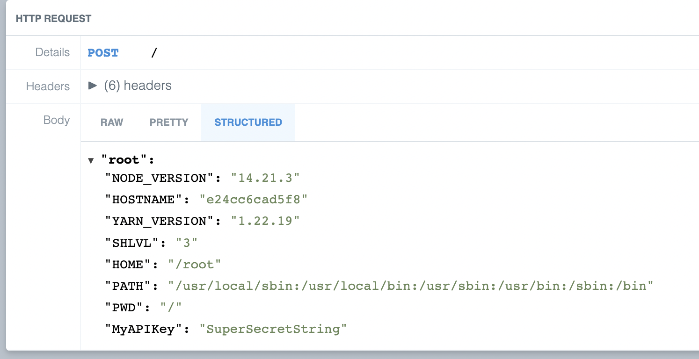
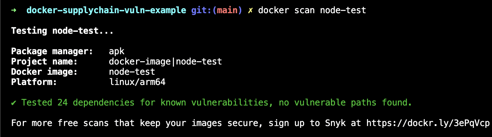
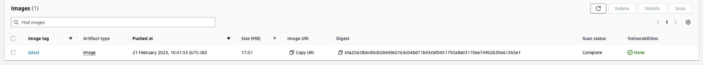

# Example of supply chain vulnerabilities  in Docker

In this example we see how an innocuous docker container that may seem to just run as node actually manages to steal enviornmentvariables.

This is a very crude example, designed to highlight the importance of using trusted base images or building your own.

Build the container images:
```bash
./build.sh
```

The example container we are running looks just like any other NodeJS container:
```Dockerfile
FROM node-test
COPY index.js index.js
CMD ["node","index.js"]
```

Run the built example container:
```bash
docker run -e MyAPIKey="SuperSecretString" js-example
```

After this has run, although it looks like it is running normally, if we look at our API endpoint

We can see that the data has been extracted.

Furthermore, if we run this new image through Docker Scan:

We can see that it comes back clean, likewise in ECR:
